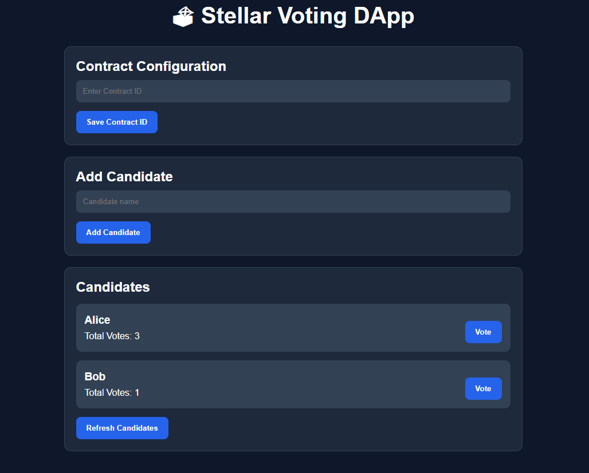
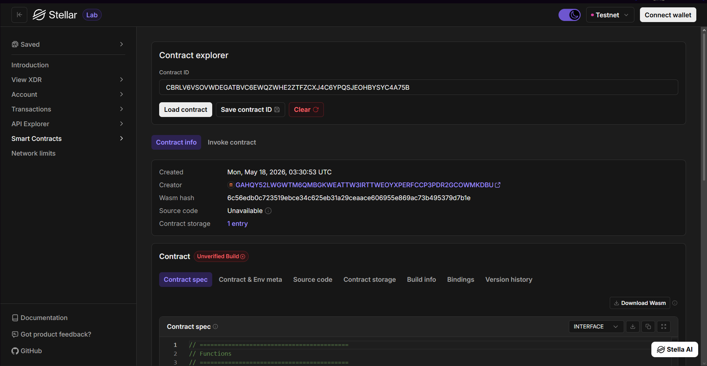

# Stellar Voting DApp

**Stellar Voting DApp** - Blockchain-Based Decentralized Voting System

## Project Description

Stellar Voting DApp is a decentralized smart contract application built on the Stellar blockchain using the Soroban SDK. The project provides a transparent, secure, and tamper-resistant voting mechanism where users can vote directly on-chain without relying on centralized servers or intermediaries.

The system is designed to demonstrate how blockchain technology can be used to create trustworthy digital voting systems. Each vote is permanently recorded on the Stellar blockchain, ensuring transparency, immutability, and verifiability of election results.

The smart contract allows administrators to create candidates while users can securely cast votes using their blockchain wallet addresses. The contract also prevents double voting by enforcing a one-wallet-one-vote mechanism.

## Application Screenshots

### Voting DApp Interface



### Smart Contract Explorer



## Project Vision

Our vision is to modernize digital voting systems through blockchain technology by:

- **Eliminating Centralized Control**: Removing dependence on centralized voting authorities
- **Increasing Transparency**: Allowing anyone to verify voting results directly on-chain
- **Preventing Manipulation**: Using immutable blockchain storage to protect voting integrity
- **Ensuring Fair Elections**: Enforcing one-wallet-one-vote validation through smart contracts
- **Building Trustless Governance**: Creating a voting infrastructure governed by code instead of institutions
- **Encouraging Decentralized Participation**: Empowering users to participate in governance securely and transparently

We envision a future where voting systems are open, verifiable, and resistant to fraud through decentralized technologies.

## Key Features

### 1. **Candidate Management**

- Add candidates directly through the smart contract
- Unique candidate identification
- Persistent candidate storage on-chain
- Admin-controlled candidate creation

### 2. **Secure Voting Mechanism**

- Vote using blockchain wallet addresses
- One-wallet-one-vote protection
- Transparent vote recording
- Immutable voting history

### 3. **Real-Time Vote Counting**

- Automatically update vote totals
- Retrieve all candidates and results instantly
- Transparent public verification
- Accurate blockchain-based counting

### 4. **Blockchain Security**

- Immutable voting records
- Tamper-resistant smart contract logic
- Decentralized storage
- Authentication using Stellar wallet addresses

### 5. **Stellar Network Integration**

- Built using Soroban Smart Contract SDK
- Powered by the Stellar blockchain
- Fast and low-cost transactions
- Scalable decentralized architecture

## Contract Details

- Contract Address: `CBRLV6VSOVWDEGATBVC6EWQZWHE2ZTFZCXJ4C6YPQSJEOHBYSYC4A75B`
- Network: Stellar Testnet

## Future Scope

### Short-Term Enhancements

1. **Voting Deadline System**
   - Add start and end voting timestamps
   - Automatic voting closure after deadlines
   - Election scheduling support

2. **Candidate Profiles**
   - Add candidate descriptions and metadata
   - Support for images and campaign details
   - Enhanced candidate information display

3. **Whitelist Voting**
   - Restrict voting access to approved addresses
   - Eligibility verification system
   - Controlled election participation

4. **Event Logging**
   - Emit blockchain events for voting actions
   - Real-time tracking of election activities
   - Better analytics integration

### Medium-Term Development

5. **DAO Governance System**
   - Upgrade from candidate voting to proposal voting
   - Community-driven governance mechanisms
   - Decentralized decision-making infrastructure

6. **Token-Based Voting**
   - Weighted voting using Stellar-based tokens
   - Governance token integration
   - Stake-based voting systems

7. **Anonymous Voting**
   - Improve voter privacy mechanisms
   - Hide voting choices while maintaining verification
   - Privacy-preserving governance

8. **Frontend Integration**
   - Web-based decentralized voting interface
   - Wallet connection support
   - Real-time blockchain synchronization

### Long-Term Vision

9. **Cross-Chain Voting**
   - Support multiple blockchain ecosystems
   - Interoperable governance systems
   - Cross-network participation

10. **Decentralized Identity (DID)**
   - Integrate decentralized identity verification
   - Improve voter authentication
   - Prevent Sybil attacks

11. **NFT Voting Badges**
   - Reward voters with NFT participation badges
   - Create on-chain achievement systems
   - Increase community engagement

12. **Mobile Voting Application**
   - Native mobile integration
   - Secure mobile wallet voting
   - Increased accessibility

13. **Zero-Knowledge Proof Voting**
   - Fully private voting mechanisms
   - Cryptographic privacy protection
   - Advanced decentralized election systems

### Enterprise and Government Use Cases

14. **University Elections**
   - Student organization voting
   - Campus governance systems
   - Transparent academic elections

15. **Corporate Governance**
   - Shareholder voting systems
   - Board election management
   - Decentralized business governance

16. **Community Decision Making**
   - Local organization governance
   - Public proposal voting
   - Decentralized communities

17. **Transparent Public Elections**
   - Secure digital election infrastructure
   - Public auditability
   - Fraud-resistant election systems

---

## Technical Requirements

- Soroban SDK
- Rust programming language
- Stellar blockchain network
- Soroban CLI

## Getting Started

Deploy the smart contract to Stellar's Soroban network and interact with it using the main contract functions:

- `initialize()` - Initialize the contract and set the admin address
- `add_candidate()` - Add a new voting candidate
- `vote()` - Vote for a candidate using a wallet address
- `get_candidates()` - Retrieve all candidates and vote counts

---

## Smart Contract Functions

### Initialize Contract

```rust
pub fn initialize(env: Env, admin: Address)
```

### Add Candidate

```rust
pub fn add_candidate(env: Env, name: String)
```

### Vote

```rust
pub fn vote(env: Env, voter: Address, candidate_id: u32)
```

### Get Candidates

```rust
pub fn get_candidates(env: Env) -> Vec<Candidate>
```

---

## Security Features

- One wallet can only vote once
- Admin authorization system
- Immutable blockchain storage
- Transparent vote verification
- Decentralized data management

---

## Build Contract

```bash
stellar contract build
```

## Deploy Contract

```bash
stellar contract deploy \
--wasm target/wasm32-unknown-unknown/release/voting.wasm \
--source alice \
--network testnet
```

---

## Run Tests

```bash
cargo test
```

---
ID Smart Contract = CBRLV6VSOVWDEGATBVC6EWQZWHE2ZTFZCXJ4C6YPQSJEOHBYSYC4A75B

---

**Stellar Voting DApp** - Building Transparent Governance on the Blockchain